# Создание проекта в GitHub 

### 1) Зарегистрируйтесь в GitHub - https://github.com/

### 2) Создайте репозиторий, в котором будет хранится ваш код.

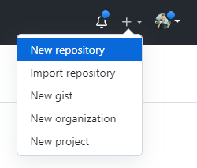

Задайте название репозитория, описание, выберите Public и добавьте .gitIgnore. Затем нажмите Create repository

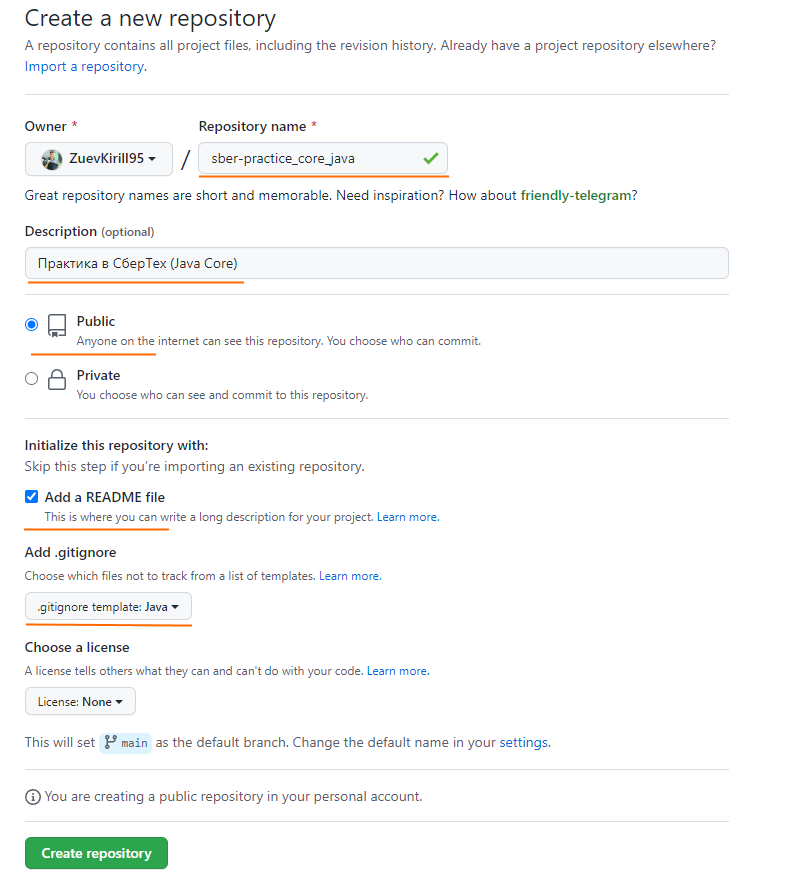

### 3)	Скопируйте ссылку на репозиторий

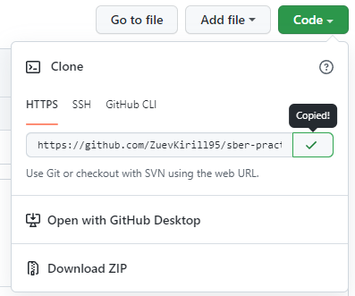

### 4) Склонируйте в IntelliJ IDEA
Git ⇒ Clone...

    Если нет кнопки Сlone, то выберите VCS ⇒ Enable Version Control Integration…

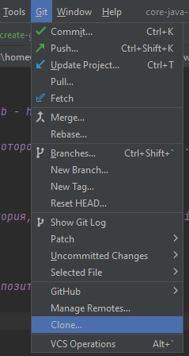

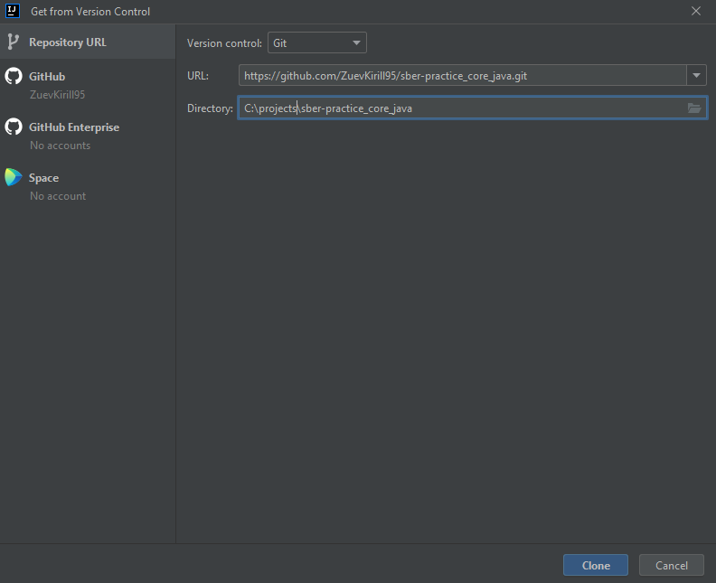

### 5) Создайте модуль base-syntax

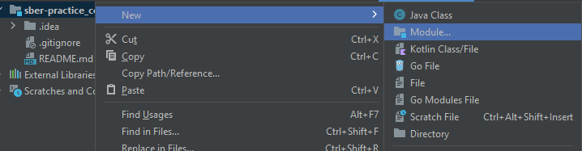

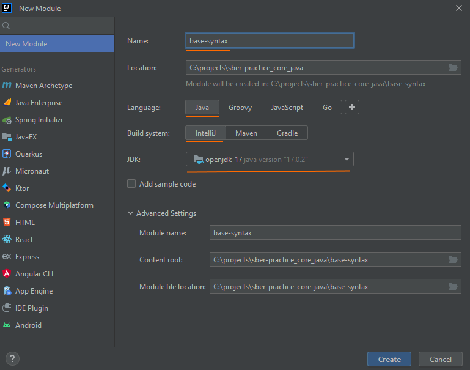

### 6) Создайтие пакет `ru.sber.base.syntax` и в этом пакете выполните задания.

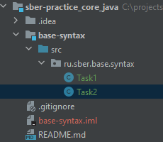

### 7)	Выберите созданные/измененные файлы и нажмите Commit and Push

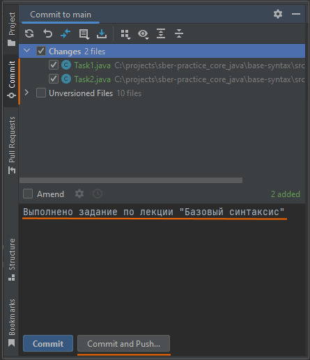

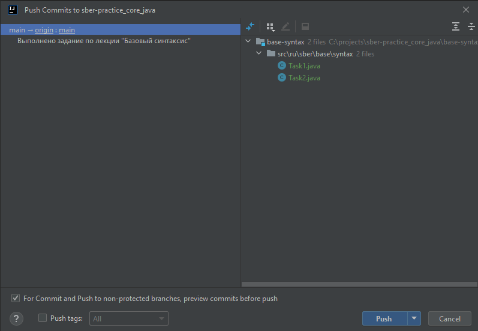

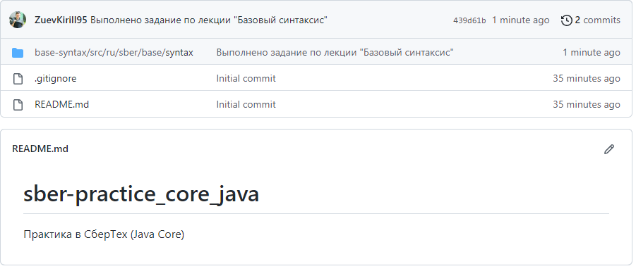

### 8) Скиньте ссылку на репоизторий для проверки домашнего задания.