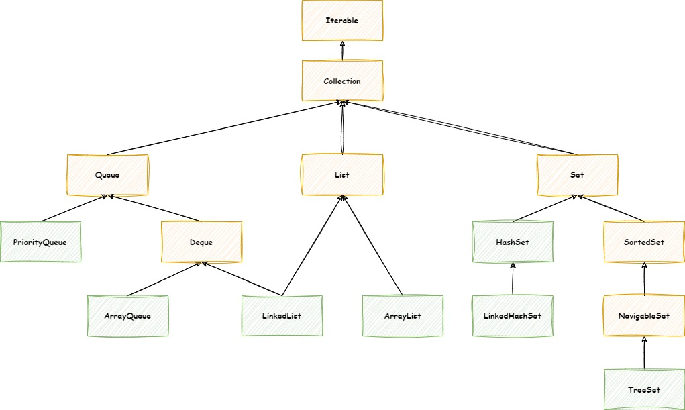

# Коллекции (Часть 1)

## Введение

Платформа Java включает в себя Collections Framework.
Коллекция - это объект, представляющий группу объектов (например, классический класс **ArrayList**). Фреймворк
коллекций - это унифицированная архитектура для представления коллекций и управления ими, позволяющая управлять
коллекциями независимо от деталей реализации.

Основные преимущества фреймворка коллекций заключаются в том, что он:

- **Сокращает затраты на программирование** за счет предоставления структур данных и алгоритмов, поэтому вам не нужно
  писать их самостоятельно.
- **Повышает производительность** за счет предоставления высокопроизводительных реализаций структур данных и алгоритмов.
  Поскольку различные реализации каждого интерфейса взаимозаменяемы, программы можно настраивать путем переключения
  реализаций.
- **Обеспечивает взаимодействие между несвязанными API** c помощью общего языка для передачи коллекций
  туда и обратно.
- **Сокращает усилия, необходимые для изучения API**, требуя от вас изучения нескольких специальных
  collection API.
- **Сокращает усилия, необходимые для разработки и реализации API**, не требуя от вас создания специальных
  collection API.
- **Способствует повторному использованию программного обеспечения**, предоставляя стандартный интерфейс для коллекций и
  алгоритмов, с помощью которых ими можно управлять.

Фреймворк коллекций состоит из:

- **Интерфейсы коллекций**. Представляют различные типы коллекций, такие как sets (множества), lists (списки) и maps (
  карты). Эти интерфейсы составляют основу фреймворка.
- **Реализации общего назначения**. Основные реализации интерфейсов коллекций.
- **Устаревшие реализации**. Классы коллекций из более ранних выпусков, Vector и Hashtable, были модифицированы для
  реализации интерфейсов коллекций.
- **Специализированные реализации**. Реализации, предназначенные для использования в особых ситуациях. Эти реализации
  отображают нестандартные характеристики производительности, ограничения использования или поведение.
- **Параллельные реализации**. Реализации, разработанные для параллельного использования.
- **Реализации оболочек**. Добавьте функциональность, такую как синхронизация, в другие реализации.
- **Удобные реализации**. Высокопроизводительные "мини-реализации" интерфейсов коллекций.
- **Абстрактные реализации**. Частичные реализации интерфейсов коллекций для облегчения пользовательских реализаций.
- **Алгоритмы**. Статические методы, которые выполняют полезные функции в коллекциях, такие как сортировка списка.
- **Инфраструктура**. Интерфейсы, обеспечивающие существенную поддержку интерфейсов коллекций.
- **Утилиты для создания массивов**. Служебные функции для массивов примитивных типов и ссылочных объектов. Строго
  говоря, не являясь частью платформы collections, эта функция была добавлена на платформу Java одновременно с
  платформой collections и опирается на часть той же инфраструктуры.

## Иерархия интерфейса Collections



**Iterable** - реализация этого интерфейса позволяет объекту быть целью расширенного for оператора (иногда называемого
for-each оператором).

Пример:

```java
class Main {
    public static void main(String[] args) {
        Iterable<Integer> list = new ArrayList<>();
        list.add(1);
        list.add(2);
        list.add(3);
        list.add(4);
        list.add(5);

        for (int num : list) {
            System.out.print(num);
        }
        // 1, 2, 3, 4, 5
    }
}
```

**Collection** - корневой интерфейс в иерархии коллекций. Коллекция представляет собой группу объектов, называемых
элементы. Некоторые коллекции допускают дублирование элементов, а другие - нет. Некоторые упорядочены, а другие
неупорядоченны. JDK не предоставляет никаких прямых реализаций этого интерфейса: он предоставляет реализации более
конкретных подинтерфейсов, таких, как `Set` и `List`. Этот интерфейс обычно используется для передачи коллекций и
управления ими там, где требуется максимальная общность.

## List (Список)

Упорядоченная коллекция (также известная как последовательность). Пользователь этого интерфейса имеет точный контроль
над тем, где в списке вставляется каждый элемент. Пользователь может получить доступ к элементам по их целочисленному
индексу (позиции в списке) и выполнять поиск элементов в списке.

В отличие от множеств, списки обычно допускают дублирование элементов и значения `null`.

### ArrayList

**ArrayList** - это одна из реализаций списка, построенная поверх массива, которая способна динамически увеличиваться и
уменьшаться по мере добавления/удаления элементов. Элементы могут быть легко доступны по их индексам, начиная с нуля.

Эта реализация обладает следующими свойствами:

- Произвольный доступ занимает O(1) времени
- Добавление элемента занимает амортизированное постоянное время O(1)
- Вставка / удаление занимает O(n) времени
- Поиск занимает O(n) времени для несортированного массива и O(log n) для отсортированного

```java
class Main {
    public static void main(String[] args) {
        List<Integer> list = new ArrayList<>();
        list.add(1);
        list.add(3);
        list.add(1, 2); // Вставка элемента 2 в индекс 1

        list.get(0); // 1
        list.get(1); // 2
        list.get(2); // 3
    }
}
```

### LinkedList

**LinkedList** - это двусвязная реализация списка интерфейсов `List` и `Deque`.
Каждый элемент является узлом, который хранит ссылку на следующий и предыдущий.

## Queue (Очередь)

**Queue** - это коллекция, хранящая последовательность элементов. Добавляется элеменит в конец очереди, а используется
из
начала очереди - правило FIFO (**F**irst **I**n, **F**irst **O**ut «первым пришёл — первым ушёл»)

**Deque** - double ended queue (двунаправленная очередь). В такой очереди элмементы могут использоваться с обоих концов.
Здесь работают оба правила FIFO и LIFO

Интерфейс `Deque` реализуется классами `LinkedList` и `ArrayDeque`.

## Класс `Collections`

`Collections` - вспомогательный класс для работы с коллекциями.

Примеры методов

```java
public class CollectionsExample {
  public static void main(String[] args) {
    List<Integer> integers = new ArrayList<>(List.of(3, 2, 1));

    // Возвращает пустой неизменяемый список.
    List<Object> emptyList = Collections.emptyList();

    // Сортирует указанный список.
    Collections.sort(integers);

    // Ищет элемент с помощью алгоритма "Двоичный поиск".
    int i = Collections.binarySearch(integers, 2);

    // Ищет максимальный элемент в списке.
    Integer max = Collections.max(integers);

    // Ищет минимальный элемент в списке.
    Integer min = Collections.min(integers);

    // Перемещает элементы в списке в обратном порядке.
    Collections.reverse(integers);
    
    // И много других
  }
}
```

## Метод `equals()`

Пример:

```java
public class Student {
    private int id;
    private String name;
    private double averageMark;

    public Student(int id, String name, double averageMark) {
        this.id = id;
        this.name = name;
        this.averageMark = averageMark;
    }
}
```

Переопределение метода equals()

```java
public class Student {
    // Поля и конструктор

    @Override
    public boolean equals(Object o) {
      if (this == o) {
        return true;
      }
    
      if (o == null || getClass() != o.getClass()) {
        return false;
      }
    
      Student student = (Student) o;
      return id == student.id
              && name.equals(student.name)
              && averageMark == averageMark;
    }
}
```

> Рекомендация
> 
> Реализацию equals() лучше доверить IDE, чтобы избежать ошибок при реализации.

```java
class Main {
  public static void main(String[] args) {
    List<Student> list = List.of(
            new Student(1, "Ivan", 4.1),
            new Student(2, "Alena", 3.9),
            new Student(3, "Sergey", 4.5)
    );


    Student sergey = new Student(3, "Sergey", 4.5);
    Student marina = new Student(4, "Marina", 4.0);

    list.contains(sergey); // true
    list.contains(marina); // false
  }
}
```

## Интерфейс `Comparable`

```java
public class Student implements Comparable<Student> {
    // Поля и конструктор

    @Override
    public int compareTo(Student o) {
        return name.compareTo(o.name);
    }
}
```

```java
class Main {
  public static void main(String[] args) {
    List<Student> list = new ArrayList<>(List.of(
            new Student("Ivan", 4.1),
            new Student("Alena", 3.9),
            new Student("Sergey", 4.5)
    ));

    Collections.sort(list); // Alena, Ivan, Sergey
  }
}
```

## Интерфейс `Comparator`

```java
public class Student {
    // Поля и конструктор

  public static class MarkComparator implements Comparator<Student> {
    @Override
    public int compare(Student o1, Student o2) {
      return Double.compare(o1.averageMark, o2.averageMark);
    }
  }
}
```

```java
class Main {
  public static void main(String[] args) {
    List<Student> list = new ArrayList<>(List.of(
            new Student("Ivan", 4.1),
            new Student("Alena", 3.9),
            new Student("Sergey", 4.5)
    ));

    list.sort(new Student.MarkComparator());
    // или с помощью анонимного класса
    list.sort(new Comparator<Student>() {
      @Override
      public int compare(Student o1, Student o2) {
        return Double.compare(o1.averageMark, o2.averageMark);
      }
    });
    // или с помощью лямбда-выражения (Java 8)
    list.sort(Comparator.comparingDouble(o -> o.averageMark));
  }
}
```