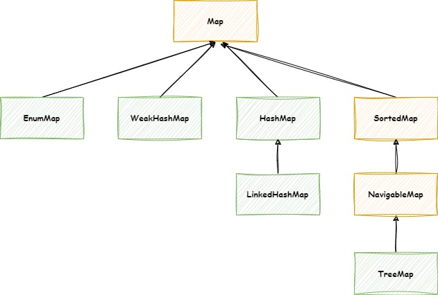
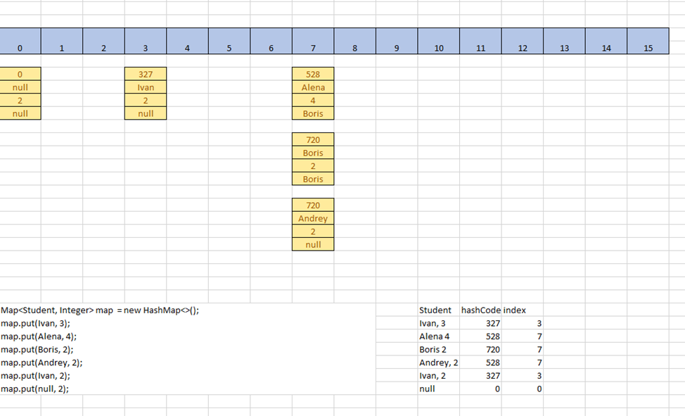

# Коллекции (Часть 2)

## Введение

**Map** (карта, словарь) представляет собой структуру данных, которая содержит набор пар “ключ-значение”.
Интерфейс `Map` не является подтипом интерфейса `Collection`. Поэтому он ведет себя немного иначе, чем остальные типы
коллекций. Map содержит уникальные ключи.

Map идеально подходят для сопоставления ассоциаций ключ-значение, таких как словари. Map используются для выполнения
поиска по ключам или когда кто-то хочет получить и обновить элементы по ключам. Некоторые распространенные сценарии
заключаются в следующем:

- Map кодов ошибок и их описаний.

```
400 - "Bad Request"
403 - "Forbidden"
404 - "Not Found"
```

- Map почтовых индексов и городов.

```
101000 - "Москва"
190000 - "Санкт-Петербург"
160000 - "Вологда"
```

- Map менеджеров и сотрудников. Каждый менеджер (ключ) связан со списком сотрудников (значением), которыми он управляет.

```
"Иванов Иван" - "Козлова Анна", "Зуев Кирилл", "Виноградова Дарья"
"Зуева Екатерина" - "Пушкин Александр", "Тараканов Андрей"
```

- Map курсов и учащихся. Каждый курс (ключ) связан со списком учащихся (значением).

```
{name: "Информатика и вычислительная техника", code: "ИВТ", year: 2022} - "Анна", "Борис", "Сергей"
{name: "Экономика и бухгалтерский учет", code: "ЭИБ", year: 2023} - "Дарья, "Жанна", "Максим"
```

## Иерархия интерфейса Map



## Методы интерфейса Map

Со всеми методами можно ознакомится
в [документации](https://docs.oracle.com/en/java/javase/17/docs/api/java.base/java/util/Map.html)

### put и get

`V put(K key, V value)` - Связывает указанное значение с указанным ключом. Если map ранее содержала указанный ключ,
старое значение заменяется указанным значением.

`V putIfAbsent(K key, V value)` - Связывает указанное значение с указанным ключом только если указанный ключ еще не
связан со значением (или сопоставлен с `null`)

`V get(Object key)` - Возвращает значение, которому сопоставлен указанный ключ, или null, если map не содержит
сопоставления для ключа.

`V	getOrDefault(Object key, V defaultValue)` - Возвращает значение, которому сопоставлен указанный ключ, или значение
по умолчанию, если эта map не содержит сопоставления для ключа.

```java
class Main {
    public static void main(String[] args) {
        Map<Integer, String> errors = new HashMap<>();

        errors.put(400, "Bad Request");
        errors.put(404, "Not Found");
        errors.putIfAbsent(404, "New Error"); // Не вставит значение, так как у ключа 404 уже есть не null значение
        errors.putIfAbsent(500, "Internal Server Error");

        errors.get(400); // "Bad Request"
        errors.get(404); // "Not Found"
        errors.get(500); // "Internal Server Error"
        errors.get(1000); // null
        errors.getOrDefault(1000, "Unknown Error"); // "Unknown Error"
    }
}
```

### remove

`V	remove(Object key)` - Удаляет отношение для ключа из этой карты, если оно присутствует.

```java
class Main {
    public static void main(String[] args) {
        Map<Integer, String> errors = new HashMap<>();

        errors.put(404, "Not Found");

        errors.remove(400); // null
        errors.remove(404); // "Not Found"
    }
}
```

### contains

`boolean containsKey(Object key)` - Возвращает значение true, если map содержит сопоставление для указанного ключа.

`boolean containsValue(Object value)` - Возвращает значение true, если map сопоставляет один или несколько ключей с
указанным значением.

```java
class Main {
    public static void main(String[] args) {
        Map<Integer, String> errors = new HashMap<>();

        errors.put(400, "Bad Request");
        errors.put(404, "Not Found");

        errors.containsKey(400); // true
        errors.containsKey(401); // false
        errors.containsValue("Not Found"); // true
        errors.containsValue("Unknown Error"); // false
    }
}
```

### entrySet, keySet, values

`Set<Map.Entry<K,V>> entrySet()` - Возвращает множество (`Set`) key-value значений, содержащихся в map.

`Set<K> keySet()` - Возвращает множество (`Set`) ключей, содержащихся на map.

`Collection<V> values()` - Возвращает представление коллекции значений, содержащихся в этой карте.

```java
class Main {
    public static void main(String[] args) {
        Map<Integer, String> errors = new HashMap<>();

        errors.put(400, "Bad Request");
        errors.put(404, "Not Found");

        for (Map.Entry<Integer, String> error : errors.entrySet()) {
            System.out.println(error.getKey() + " - " + error.getValue());
        }
        // 400 - Bad Request
        // 404 - Not Found

        for (Integer errorCode : errors.keySet()) {
            System.out.println(errorCode);
        }
        // 400
        // 404

        for (String errorMessage : errors.values()) {
            System.out.println(errorMessage);
        }
        // Bad Request
        // Not Found
    }
}
```

### of

`<K,V> Map<K,V> of()` - Возвращает неизменяемую map. Принимает от 0 до 10 значений.

```java
class Main {
    public static void main(String[] args) {
        Map<Object, Object> emptyMap = Map.of();
        Map<String, Integer> oneElementMap = Map.of("One", 1);
        Map<String, Integer> threeElementMap = Map.of("One", 1, "Two", 2, "Three", 3);

        threeElementMap.get("Three"); // 3
        threeElementMap.put("Four", 4); // UnsupportedOperationException
        threeElementMap.remove("Four", 4); // UnsupportedOperationException
    }
}
```

## HashMap

Элементами `HashMap` являются пары ключ/значение.
HashMap не запоминает порядок добавления элементов. Его методы работают очень быстро.

Ключи элементов должны быть уникальными. Ключ может быть `null`.

Значения элементов могут повторяться. Значения могут быть `null`.

```java
class Main {
    public static void main(String[] args) {
        Map<Integer, String> errors = new HashMap<>();
        errors.put(400, "Bad Request");
        errors.put(403, "Forbidden");
        errors.put(404, "Not Found");
        errors.put(null, "Unknown Error");
        errors.put(200, null);
    }
}
```

Внутрення реализация `HashMap`



HashMap использует массив узлов (`Node<K,V>[] table`), где узел содержит такие поля, как ключ, значение,
хеш и ссылку на следующий узел.
Здесь узел представлен классом `Node`. По сути, `HashMap` имеет массив, в котором хранятся данные типа
ключ-значение. Он вычисляет индекс в массиве, где может быть размещен узел, и он помещается туда. Теперь, получая
элемент из `HashMap`, он снова вычисляет индекс элемента (по хешу ключа) для извлечения и переходит к индексу массива и
возвращает значение элемента / узла (если существует).

### hashCode

Для оптимальной работы `HashMap` необходимо у класса ключа переопределить метод `int hashCode()`, следуя следующим
правилам:

- Если переопределяете метод `equals()`, то переопределите и метод `hashCode()`

```java
public class Student {
    private String name;
    private double averageMark;

    @Override
    public boolean equals(Object o) {
        if (this == o) return true;
        if (o == null || getClass() != o.getClass()) return false;
        Student student = (Student) o;
        return Double.compare(student.averageMark, averageMark) == 0 && Objects.equals(name, student.name);
    }

    @Override
    public int hashCode() {
        return Objects.hash(name, averageMark);
    }
}
```

- Результат нескольких выполнений метода `hashCode()` для одного и того же объекта должен быть одинаковым.
- Если, согласно методу `equals()`, два объекта равны, то и hashсode данных объектов обязательно должен быть одинаковым.
- Если, согласно методу `equals()`, два объекта **НЕ** равны, hashcode данных объектов **НЕ**обязательно должен быть
  разным.
- Ситуация, когда результат метода `hashCode()` для разных объектов одинаков, называется коллизией. Чем её меньше, тем
  лучше.

## LinkedHashMap

`LinkedHashMap` является наследником `HashMap`. Хранит информацию о порядке добавления элементов или порядке их
использования. Производительность методов немного ниже, чем у методов `HashMap`.

## ThreeMap

Элементами TreeMap являются ключ/значение. В TreeMap элементы хранятся в отсортированном по возрастанию порядке.
В основе TreeMap лежит красно-черное дерево. Это позволяет методам работать быстро, но не быстрее, чем методы HashMap.

[//]: # (TODO: Добавить про методы tailMap, headMap, lastEntry, firstEntry)

## Set (Множество)

`Set` - коллекция, хранящая уникальные элементы.

## HashSet

`HashSet` не запоминает порядок добавления элементов. В основе HashSet лежит `HashMap` у элементов данного `HashMap`:
ключи - это элементы `HashSet`, значения - это константа-заглушка.

## LinkedHashSet

`LinkedHashSet` является наследником `HashMap`. Хранит информацию о порядке добавления элементов. Производительность
методов немного ниже, чем у методов `HashSet`.

В основе `LinkedHashSet` лежит `HashMap`. У элементов данного `HashMap`: ключи - это элементы `LinkedHashSet`,
значения — это константа-заглушка.

## TreeSet

`TreeSet` хранит элементы в отсортированном по возрастанию порядке. В основе `TreeSet` лежит `TreeMap`. У элементов
данного`TreeMap`: ключи - это элементы `TreeSet`, значения — это константа-заглушка. 