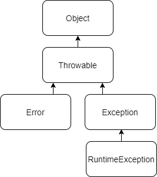

# Исключения

**_Исключение_** _-_ возникновение ошибок и непредвиденных ситуаций при выполнении программы.

**Ключевые слова**, Обработка исключений в Java основана на использовании в программе следующих ключевых слов:

- **try** – определяет блок кода, в котором может произойти исключение;
- **catch** – определяет блок кода, в котором происходит обработка исключения;
- **finally** – определяет блок кода, который является необязательным, но при его наличии выполняется
  в любом случае независимо от результатов выполнения блока try.
- **throw** – используется для выбрасывания исключения;
- **throws** – используется в сигнатуре методов для предупреждения, о том, что метод может выбросить исключение.

## Иерархия исключений

Иерархия исключений, как показано на рисунке, все классы исключений и ошибок наследуются от класса Throwable,
который, в свою очередь, наследуется от класса Object.



## Проверяемые исключения

- К проверяемым исключениям относятся исключения типа Exception и все классы, которые являются
  подтипом класса Exception, кроме класса RuntimeException и его подтипов.
- Проверяемые исключения проверяются компилятором на этапе компиляции
- Если в методах может генерироваться проверяемое исключение, то этот факт должен быть указан
  в объявлении методов с помощью оператора throws.
- Все проверяемые исключения должны быть перехвачены в явном виде блоком catch.

## Непроверяемые исключения

- К непроверяемым классам исключениям относятся исключения типа RuntimeException и всех его подтипов.
- Компилятор не контролирует непроверяемые исключения во время компиляции
- Непроверяемые исключения возникают во время выполнения программы вследствие ошибок в ее
  коде (например, выход индекса массива за допустимые пределы, деление на нуль или исключение
  при использовании нулевого указателя) или исчерпания системных ресурсов.
- Непроверяемые исключения необязательно должны обрабатываться
- Если в методе генерируется непроверяемое исключение, то этот факт можно указать (а можно и не указывать) в его
  объявлении.

## Ошибки

- Ошибки, как правило, являются необратимыми и отражают серьезные ситуации.
- Ошибки не проверяются во время компиляции программы и необязательно должны (но могут) перехватываться/обрабатываться

## Популярные проверяемые исключения:

* **IOException** - Генерируется, когда операция ввода-вывода завершается аварийно или досрочно прекращается по какой-либо причине.
* **EOFException** - Генерируется при попытке прочитать очередную порцию данных из файла, если ранее был достигнут конец файла.
Является подтипом IOException
* **FileNotFoundException** - Генерируется при попытке открыть файл, который невозможно найти. Является подтипом IOException
* **SQLException** - Генерируется, когда происходит ошибка при работе с базой данных.

## Популярные непроверяемые исключения:

* **NullPointerException** - Генерируется, когда для ссылки на некий объект используется null.
* **IllegalArgumentException** - Генерируется во время вызова метода, которому передан аргумент недопустимого типа.
* **IndexOutOfBoundsException** - Генерируется если значение индекса выходит за допустимые пределы.
* **ArrayIndexOutOfBoundsException** - Генерируется если значение индекса массива выходит за допустимые пределы.
* **ClassCastException** - Генерируется при попытке преобразования объекта в подкласс, экземпляром которого этот объект не является.
* **DataTimeException** - Генерируется при возникновении проблем при работе с объектами даты/времени.
* **NumberFormatException** - Генерируется при попытке некорректного преобразования строки в число.
* **ArithmeticException** - Генерируется, если во время выполнения арифметических операций происходит исключительная ситуация.

## Популярные ошибки

* **OutOfMemoryError** - Генерируется в случае нехватки памяти при её выделении какому-либо объекту или выполнении
  сборки мусора.
* **StackOverflowError** - Генерируется в случае переполнения программного стека.

## Примеры кода

1. try/catch:

```java
try {
    writeFile();
} catch (EOFException e) {
    System.out.println("Ошибка: Неожиданный конец файла");
} catch (IOException e) {
    System.out.println("Ошибка при работе с файлом");
}
```

2. try/catch/finally:

```java
FileWriter fileWriter = null;
try {
    fileWriter = new FileWriter("text.txt");
    fileWriter.write("Информация");
} catch (IOException e) {
    System.out.println("Ошибка при работе с файлом");
} finally {
    try {
        fileWriter.close();
    } catch (Exception e) {
        System.out.println("Ошибка при закрытии файла");
    }
}
```

3. try с ресурсами (JDK 7):

```java
try (FileWriter fileWriter = new FileWriter("text.txt")) {
    fileWriter.write("Информация");
} catch (IOException e) {
    System.out.println("Ошибка при работе с файлом");
}
```

4. Генерация исключения в методе:

```java
void writeFile(String str) throws IOException {
    if (str == null) {
        throw new IOException("Строка не должна быть равна null");
    }
    ...
}
```

## Определение собственного класса исключения

Исключения, определяемые программистом, должны создаваться в случаях, когда возникает потребность в исключениях, 
не предусмотренных в Java. Вообще говоря, когда это возможно, следует пользоваться исключениями, предусмотренными 
в Java.

- Чтобы создать _проверяемое исключение_, новый класс должен расширить, непосредственно или посредственно 
класс _Exception_
- Чтобы создать _непроверяемое исключение_, новый класс должен расширить, непосредственно или посредственно класс 
_RuntimeException_
- Создаваемый класс-исключение в названии, в конце должен содержать Exception
  Примеры: **MyException**, **CustomException**
- Созданное исключение должно по меньшей мере определить два конструктора: один без аргументов, 
а другой с аргументом сообщения об ошибке.

Пример:

```java
public class BankOnlineException extends Exception {
    BankOnlineException() {}

    BankOnlineException(String message){
        super(message);
    }
}
```

## Рекомендации при обработке исключений

1. Обработка исключения не может заменить собой проверку.

Как не надо:

```java
try {
    stack.pop();
} catch (EmptyStackException e) {}
```

Как надо:

```java
if (!stack.isEmpty()) {
    stack.pop();
}
```

2. Не подавляйте исключения

Как не надо:

```java
try {
// код, способный генерировать проверяемые исключения
}
catch (Exception е)
{} // ничего не делать!
```

3. Обнаруживая ошибки проявляете необходимую твердость вместо излишней терпимости.

Как не надо:

```java
int pop() {
    if (stack.isEmpty) {
        return null;
    }
    ...
}
```

Как надо:

```java
int pop() {
    if (!stack.isEmpty()) {
        throw new EmptyStackException();
    }
    ...
}
```

