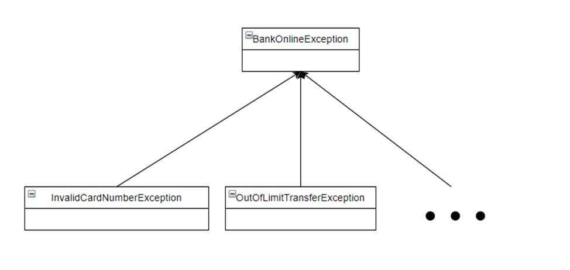

# Исключения

Разработать класс **BankOnline**, в котором необходимо реализовать метод send c двумя аргументами- Номер карты 
(String) и Сумма перевода (Double)

```java
public class BankOnline {
    public void send(String cardNumber, Double money) {
        // Реализация метода
    }
}
```

При вызове метода нужно выбрасывать исключения в случае:

1. Неправильно введенной карты (Номер должен содержать только цифры и их должно быть ровно 16)
2. Если осуществляется перевод на заблокированные карты. Для этого нужно создать внешний текстовый файл, в котором будут указаны номера карт:

- 1111 1111 1111 1111
- 2222 2222 2222 2222
- 3333 3333 3333 3333

1. Если введена отрицательная сумма перевода
2. Если превышен лимит в 50 000
3. Если хотя-бы один из аргументов равен null

Создайте свои классы исключений. Все исключения должны быть **проверяемыми** и наследоваться от общего класса
исключения BankOnlineException. Пример:

