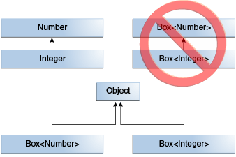

# Обобщения (Generics)

## Определение

**Generics** (a.k.a **Дженерики**, **обобщения**) - Термин Generic по сути означает параметризованный тип. 
Специфика параметризованных типов состоит в том, что они позволяют создавать
классы, интерфейсы и методы, в которых тип данных указывается в виде параметра. Используя обобщения, можно
создать единственный класс или метод, который будет автоматически работать с различными типами данных.

## Преимущества использования дженериков

* Автоматическая работа с типом данных, переданным ему в качестве параметра. Позволяет написать один алгоритм, 
который будет работать с различными типами.

* Проверка типов, позволяет выявить ошибку на этапе компиляции, до запуска программы.

Пример:

 Код без дженериков

```java
List numbers = new ArrayList();

// «Случайно» вставляем строку вместо числа.
numbers.add("100");

//Необходимо привести полученное число к int
//При приведении строки в число возникнет ошибка во время выполнения программы
int num = (int) numbers.get(0);
```

Код с использованием дженериков

```java
List<Integer> numbers = new ArrayList();

// «Случайно» вставляем строку вместо числа.
// Здесь произойдет ошибка во время компиляции
numbers.add("100");

// Обратите внимание, что больше не нужно приводить число к int
int num = numbers.get(0);
```
## Пример параметризованного класса

```java
public class GenericClass<T> {
  private T value;

  public T getValue() {
    return value;
  }

  public void setValue(T value) {
    this.value = value;
  }
}
```

## Пример параметризованного метода

```java
public <E> E getLastValue(List<E> list){
    return list.get(list.size()-1);
}
```

## Соглашение по наименованию

- **E** – элементы в коллекции
- **K, V** – ключ и значение
- **N** – числа
- **T** – тип
- **S,U,V и т.д.** – 2-ой, 3-ий, 4-ый типы

## Как нельзя использовать дженерики

### Нельзя объявлять параметризованное поле как static.

```java
public class Forbidden<T> {
    private static T value;
}
```

### Нельзя инициализировать параметризованный объект

```java
new T();
```
### Нельзя параметризовать примитивными типами

```java
final List<int> ids = new ArrayList<>();
```
### Нельзя создавать параметризованные исключения

```java
class GenericException<T> extends Exception {}
```

## Параметры типа, границы и символы подстановки


```
<T>            Неограниченный тип
<T, P>         Неограниченные типы
<T extends P>  Тип, ограниченный сверху. Особый тип T, ко торый является подтипом типа P
<?>            Неограниченный символ подстановки (WildCard)
<? extends P>  Ограниченный символ подстановки (WildCard). Некий неизвестный тип, который является подтипом типа P
<? super P>    Ограниченный символ подстановки (WildCard). Некий неизвестный тип, который является супертипом типа P
```
# Особенности наследования

