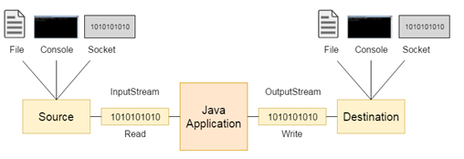

# Потоки ввода вывода (Java I/O)

**Поток (Stream)** — это последовательность данных. ВJava поток состоит из байтов.

**Поток ввода (Input)** — поток ввода используется для считывания данных из источника (файла, консоли, сокета и др.)

**Поток вывода (Output)** — поток вывода используется для записи данных по месту назначения. (в файл, консоль,
сокет и др.).



## Байтовый поток

**Байтовый поток (Byte Stream)** — поток для последовательного чтения/записи байтов. Наследуются от классов

Пример чтения и записи файла.

```java
try (FileInputStream fileInputStream = new FileInputStream("text.txt");
     FileOutputStream fileOutputStream = new FileOutputStream("copyText.txt")) {
    int b;
    while ((b = fileInputStream.read()) != - 1 ) {
        fileOutputStream.write(b);
    }
}
```

## Символьный поток

**Символьный поток (Character Stream)** — поток для последовательного чтения/записи символов. Наследуются от
классов Reader и Writer соответственно.

```java
try (FileReader fileInputStream = new FileReader("text.txt");
     FileWriter fileOutputStream = new FileWriter("copyText.txt")) {
    int b;
    while ((b = fileInputStream.read()) != - 1 ) {
        fileOutputStream.write(b);
    }
}
```

## Буферный поток

**Буферный поток (Buffered Stream)** — поток для чтения/записи пачки байтов. Таким образом количество обращений
к источнику (например файлу на жестком диске) сильно уменьшается и, следовательно, запись или чтение
происходит быстрее.

```java
try (BufferedInputStream fileInputStream = new BufferedInputStream(new FileInputStream("text.txt"));
     BufferedOutputStream fileOutputStream = new BufferedOutputStream(new FileOutputStream("copy- Text.txt"))) {
    int b;
    while ((b = fileInputStream.read()) != - 1 ) {
        fileOutputStream.write(b);
    }
}
```

## Поток данных

**Поток данных (Data Stream)** — поток для чтения/записи примитивных типов.

```java
try (DataOutputStream out = new DataOutputStream(new BufferedOutputStream(new FileOutputStream(dataFile)));
     DataInputStream in = new DataInputStream(new BufferedInputStream(new FileInputStream(dataFile)))) {
        out.writeDouble(1.2);
        out.writeInt( 5 );
        out.writeBoolean(true);
        out.writeUTF("string");

        in.readDouble();
        in.readInt();
        in.readBoolean();
        in.readUTF();
}
```
## Поток объектов

**Поток объектов (Object Stream)** — поток для чтения/записи объектов.

```java
try (FileOutputStream outputStream = new FileOutputStream("save.txt");
     ObjectOutputStream objectOutputStream = new ObjectOutputStream(outputStream);
     FileInputStream fileInputStream = new FileInputStream("save.bin");
     ObjectInputStream objectInputStream = new ObjectInputStream(fileInputStream)) {
    Hero hero = new Hero("Jack");

    objectOutputStream.writeObject(hero);

    hero = (Hero) objectInputStream.readObject();
}
```
> Внимание: Объекты должны быть сериализуемыми.

```java
public class Hero implements Serializable {
    private static final long serialVersionUID = 1L;
}
```
**Сериализация** — это процесс сохранения состояния объекта в последовательность байт.

**Десериализация** — это процесс восстановления объекта из этих байт.

## Произвольный доступ к файлу

**Произвольный доступ к файлу (RandomAccessFile)** позволяет читать/записывать в файл с любого указанного места.

```java
try (RandomAccessFile raf = new RandomAccessFile("text.txt", "rw")) {
    raf.writeBytes("Wake up, Neo!");
    raf.seek( 9 );
    raf.writeBytes("Samurai!");
}
```
## Операции над файлом.

Создать объект, представляющий файл, можно двумя способами:

### Современный способ:

```java
Path file = Paths.get("text.txt");
```
### Старый способ:

```java
File file = new File("text.txt");
```
### Для работы с фалом используется статический класс Files

Методы класса Files Описание

| Методы класса Files                     | Описание                                        |
|-----------------------------------------|-------------------------------------------------|
| Path createFile(…)                      | Создает файл на диске.                          |
| Path createDirectory(…)                 | Создает директорию.                             |
| Path createDirectories(…)               | Создает директорию и поддиректории.             |
| Path createTempFile(…)                  | Создает «временный файл»                        |
| Path createTempDirectory(…)             | Создает «временную директорию»                  |
| void delete(Path path)                  | Удаляет файл/директорию.                        |
| Path copy(Path source, Path target,…)   | Копирует файл.                                  |
| Path move(Path source, Path target,…)   | Перемещает файл.                                |
| boolean isSameFile(Path, Path)          | Сравнивает два файла.                           |
| boolean isDirectory(Path)               | Путь — это директория?                          |
| boolean isRegularFile(Path)             | Путь – это файл?                                |
| long size(Path)                         | Возвращает размер файла.                        |
| boolean exists(Path)                    | Объект с таким именем существует?               |
| boolean notExists(Path)                 | Объект с таким именем не существует?            |
| long copy(InputStream, OutputStream)    | Копирует байты из InputStream в OutputStream.   |
| long copy(Path, OutputStream)           | Копирует все байты из Path в OutputStream.      |
| long copy(InputStream, Path)            | Копирует все байты из InputStream в Path.       |
| byte read(InputStream, int initialSize) | Читает массив байт из InputStream.              |
| byte readAllBytes(Path path)            | Читает все байты из InputStream.                |
| List<String> readAllLines(Path path,..) | Читает текстовый файл, возвращает список строк. |
| Path write(Path path, byte bytes,…)     | Пишет массив байт в файл.                       |
