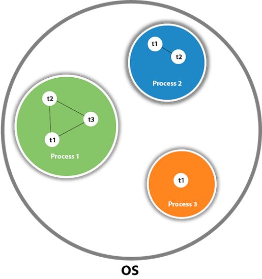

# Многопоточность (Часть 1)

**Многопоточность** - это принцип построения программы, при котором несколько блоков кода могут выполняться
одновременно.



**Процесс** — это совокупность кода и данных, разделяющих общее виртуальное адресное пространство. Процессу выделяется
память, какие-то ресурсы, а также он содержит по крайней мере один поток.

**Один поток** – это одна единица исполнения кода. Каждый поток последовательно выполняет инструкции процесса, которому
он
принадлежит, параллельно с другими потоками этого процесса.

Поскольку у одного процесса может быть несколько потоков, а ресурсы у процесса одни, то все эти потоки будут работать с
этими одними ресурсами, причём почти одновременно.

**Многопоточность** — это процесс одновременного выполнения нескольких потоков.

## Процессы vs потоки

| Процессы                                                  | Потоки                                                          |
|-----------------------------------------------------------|-----------------------------------------------------------------|
| Приложение со своим набором ресурсов и собаченной памятью | "Живут" в одном процессе                                        |
| Взаимодействие через Межпроцессное взаимодействие         | Используют общую память и другие ресурсы приложения             |
| Можно запускать на нескольких компьютерах                 | Старт приложения - создания main потока                         |
|                                                           | Потоки могут порождать другие потоки и взаимодействовать с ними |

## Преимущество многопоточности

- Позволяет улучшить скорость обработки данных.
- Позволяет одновременно выполнять несколько действий.
  Например, отрисовка интерфейса и выполнение вычислений.

## Недостатки многопоточности

- Потоки манипулируют данными, расположенными в одной и той же памяти, принадлежат одному и тому же процессу, и
  необходимо обеспечивать синхронизацию и согласованность данных между потоками;
- Довольно сложно проектировать многопоточные приложения и трудно отлаживать в случае ошибок;
- Когда потоков много, процессору приходится переключаться между потоками. Этот процесс называется переключением
  контекста. Переключение между потоками — дорогостоящая операция, поскольку процессор должен сохранять локальные данные
  одного потока и загружать локальные данные другого потока. В конечном счете общая производительность пострадает, а не
  улучшится, если будет слишком много потоков.

## Способы создания потоков

### 1 Наследование от Thread

```java
class MyThread extends Thread {
    @Override
    public void run() {
        for (int i = 0; i < 500; i++) {
            System.out.println(i);
        }
    }
}
```

```java
public class ThreadCreator {
    public static void main(String[] args) {
        MyThread myThread = new MyThread();

        myThread.start();
    }
}
```

### 2 Реализация интерфейса Runnable

```java
class MyThread implements Runnable {
    @Override
    public void run() {
        for (int i = 0; i < 500; i++) {
            System.out.println(i);
        }
    }
}
```

```java
public class ThreadCreator {
    public static void main(String[] args) {
        Thread myThread = new Thread(new MyThread());

        myThread.start();
    }
}
```

### 3 Через лямбда-выражение

```java
public class ThreadCreator {
    public static void main(String[] args) {
        Thread myThread = new Thread(() -> {
            for (int i = 0; i < 500; i++) {
                System.out.println(i);
            }
        });

        myThread.start();
    }
}
```

## Имя потока

По умолчанию имена потоков задаются как:

```text
Thread-1
Thread-2
Thread-3
...
Thread-N
```

Задать свое имя можно 2 способами

1. Через аргумент конструктора

```java
public class ThreadExample {

    public static void main(String[] args) {
        Thread thread = new Thread(new MyThread(), "CustomName");

        thread.getName(); // "CustomName"
    }
}
```

2. Через setter

```java
public class ThreadExample {

    public static void main(String[] args) {
        thread.setName("CustomName");

        thread.getName(); // "CustomName"
    }
}
```

## run() vs start()

> Для запуска потока используйте `start()`, а не run()

```java
public class WhyStartNotRun {
    public static void main(String[] args) {
        Thread thread = new Thread(new MyThread());
        thread.run();
    }
}
```

`run()` - не создаст новый поток. Метод будет выполнен последовательно.

```java
public class WhyStartNotRun {
    public static void main(String[] args) {
        Thread thread = new Thread(new MyThread());
        thread.start();
    }
}
```

`start()` - создаст новый поток. Метод будет выполнен параллельно.

## sleep()

`sleep()` - Переводит текущий выполняющийся поток в спящий режим (временно прекращает выполнение) на указанное количество
миллисекунд

## join()

`join()` - Ожидает завершения этого потока.


