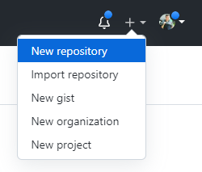
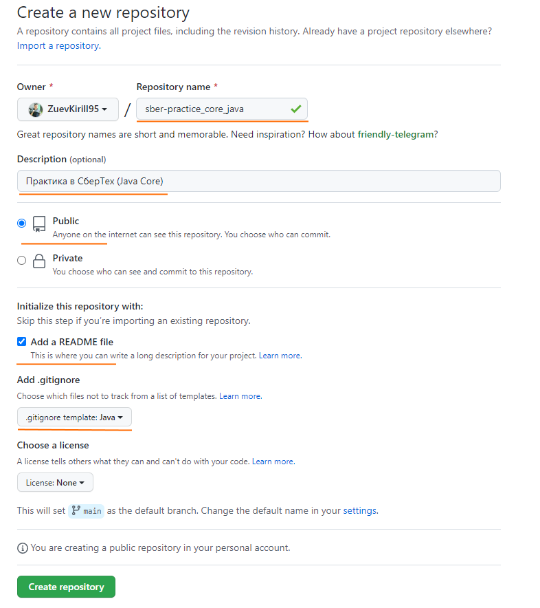
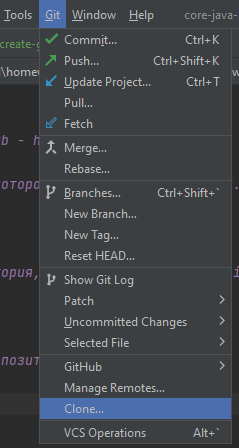
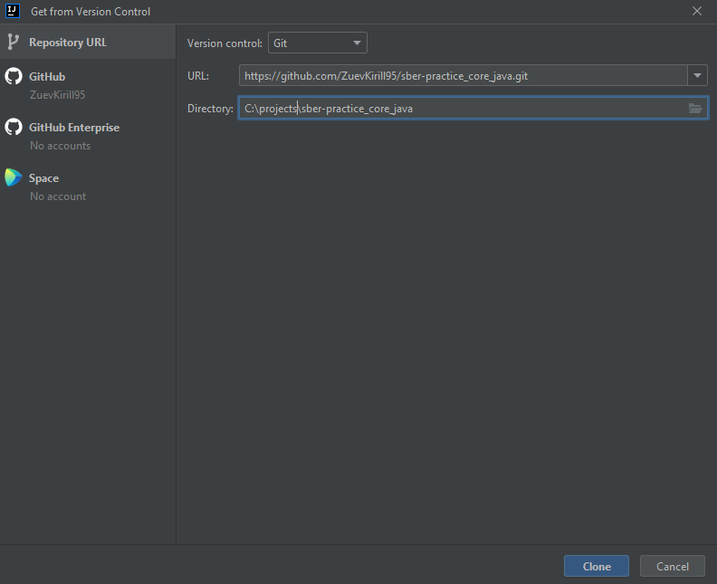
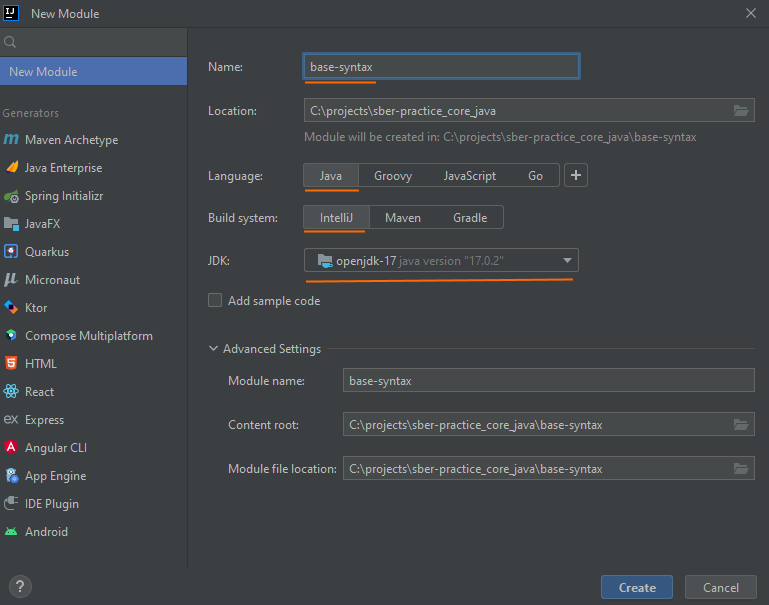
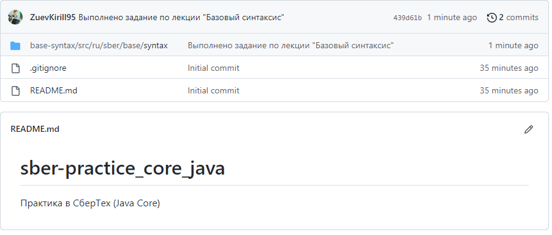

# Создание проекта в GitHub 

### 1) Скачать Git - https://git-scm.com/downloads

### 2) Зарегистрируйтесь в GitHub - https://github.com/

### 3) Создайте репозиторий, в котором будет хранится ваш код.

Задайте название репозитория, описание, выберите Public и добавьте .gitIgnore. Затем нажмите Create repository

### 4)	Скопируйте ссылку на репозиторий

### 5) Склонируйте в IntelliJ IDEA
Git ⇒ Clone...

    Если нет кнопки Сlone, то выберите VCS ⇒ Enable Version Control Integration…

### 6) Создайте модуль base-syntax

### 7) Создайтие пакет `ru.sber.base.syntax` и в этом пакете выполните задания.

### 8)	Выберите созданные/измененные файлы и нажмите Commit and Push

### 9) Скиньте ссылку на репозиторий для проверки домашнего задания.